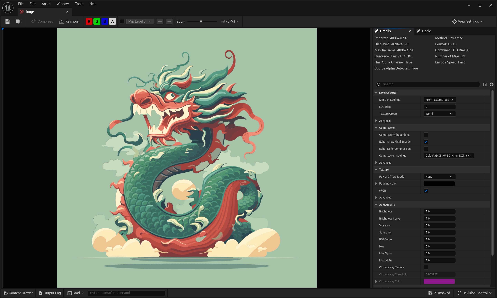

## Editor
### 1. Enable SvgAssertImporter Plugin

### 2. Import Your SVg File
#### A.Example1
  
  
  

#### B.Example2
 
  
  

## Runtime

#### 1. UI_SVGAssetImporterExample

#### 2. Create Texture2D 

#### 3. Create Texture2DDynamic 

## Support

If you need to contact me or require any assistance, please reach out to me at the following email address: <strong> [bairizuomeng233@gmail.com] </strong> . I will respond to your email as soon as possible.